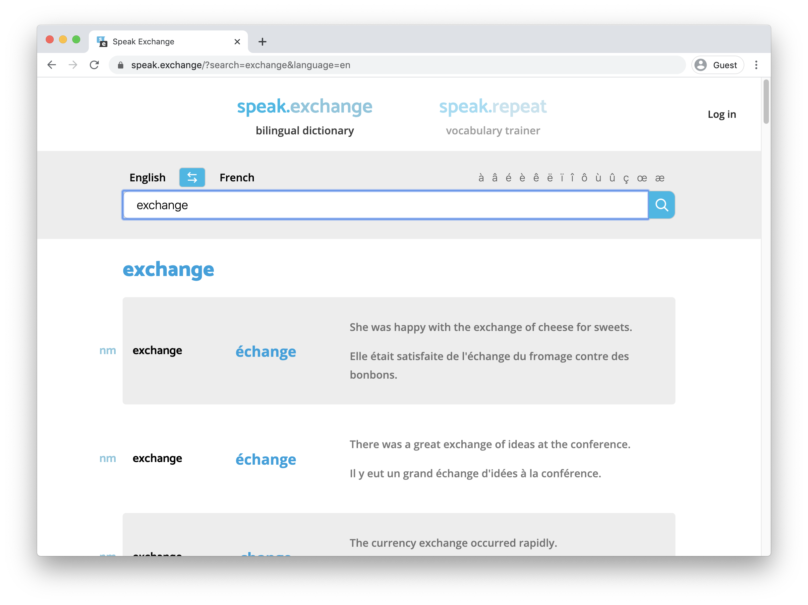

# Speak.exchange

[speak.exchange](https://www.speak.exchange 'Speak Exchange') is an online bilingual dictionary, which offers the sub-app speak.repeat, which is a spaced-repetition system (SRS) app geared towards learning new words in a foreign language through flashcards.



<details>
  <summary>Table of contents</summary>
  
- [What have we done?](#what-have-we-done)
- [What do we plan to do next?](#what-do-we-plan-to-do-next)
- [How is our project structured?](#how-is-our-project-structured)
  - [/components](#components)
  - [/pages](#pages)
  - [/utils](#utils)
  - [Miscellaneous](#miscellaneous)
- [Web App Link and Repository Link](#web-app-link-and-repository-link)
</details>

## What have we done?

We have so far implemented most of the MVP of speak.exchange in that it currently fetches translations in English to French from the WordReference API, presenting them to the user. These searches can be shared thanks to persistent URLs. We have also started the implementation of the MVP of speak.repeat, but have so far only implemented the funcionality to create user-based deck and save words to the deck. This project is a [Next.js](https://nextjs.org/) project bootstrapped with [`create-next-app`](https://github.com/zeit/next.js/tree/canary/packages/create-next-app).

## What do we plan to do next?

We will implement a search history and saved wordlist based on user profiling. We are also yet to implement user authentication, user profiles, and the SRS app within speak.repeat. We intend to complete most functionality of speak.exchange before the peer review, and to complete speak.repeat post-peer review.

## How is our project structured?

```
.
├── .github
│   └── workflows
│       └── push.yml
├── components
│   ├── browse-decks
│   │   ├── DeckBox.js
│   │   ├── DeckSearch.js
│   │   ├── RepeatHome.js
│   │   ├── RepeatHomeContainer.js
│   │   ├── ViewBar.js
│   │   └── useViewDecks.js
│   ├── deck
│   │   ├── EditDeck.js
│   │   ├── EditDeckContainer.js
│   │   ├── WordCardEdit.js
│   │   └── useEditDeck.js
│   ├── exchange
│   │   ├── SearchBar.js
│   │   ├── SearchExchange.js
│   │   ├── Translation.js
│   │   └── useSearchTranslation.js
│   ├── ui-fragments
│   │   ├── Button.js
│   │   ├── Container.js
│   │   ├── ErrorBox.js
│   │   ├── Input.js
│   │   ├── LogInButton.js
│   │   ├── LoggedInView.js
│   │   ├── Navbar.js
│   │   └── Spinner.js
│   ├── FireBaseAuthProvider.js
│   ├── Meta.js
│   └── Page.js
├── pages
│   ├── _app.js
│   ├── _document.js
│   ├── edit-deck.js
│   ├── index.js
│   └── repeat.js
├── public
│   ├── android-chrome-192x192.png
│   ├── android-chrome-512x512.png
│   ├── apple-touch-icon.png
│   ├── browserconfig.xml
│   ├── favicon-16x16.png
│   ├── favicon-32x32.png
│   ├── favicon.ico
│   ├── mstile-150x150.png
│   ├── safari-pinned-tab.svg
│   └── site.webmanifest
├── utils
│   ├── api-config.js
│   ├── debounce.js
│   ├── fetchers.js
│   ├── firebase-config.js
│   ├── screen-sizes.js
│   ├── theme.js
│   └── useToggle.js
├── LICENSE
├── README.md
├── demo-screenshot.png
├── package-lock.json
└── package.json
```

Components are divided into directories based on functionality. The ([components](#/components)) sub-directories contain both stateless presentational components and their equivalent container components that maintain state and business logic. They also contain custom hooks. In the sub-directory `/ui-fragments` we place presentational components that are highly reusable. Additionally, there is one directory for our pages ([pages](#/pages)), reusable utility functions ([utility](#/utils)), and any public assets (public). All other files are non-essential and exist for documentation, package management, ci-configuration, or similar (see [Miscellaneous](#Miscellaneous)).

### /components

This directory is for presentational and container components, as well as hooks.

- **FireBaseAuthProvider.js:** Provides user auth context.
- **Meta.js:** Holds HTML header `<head>...</head>` information.
- **Page.js:** Wrapper for all page components, providing a theme provider, and firebase context etc.

#### browse-deck

This directory provides components for browsing decks. Either all decks or only your decks.

- **DeckBox.js:** A card component, representing a deck.
- **DeckSearch.js** Search sidebar presented in speak.repeat.
- **RepeatHome.js** Presentational component for speak.repeat start page.
- **RepeatHomeContainer.js** Container component for speak.repeat start page.
- **useViewDecks.js:** The hook used in `RepeatHomeContainer`.
- **ViewBar.js** The viewbar below the navigation bar in speak.repeat.

#### deck

This directory provides components for viewing and editing specific decks.

- **EditDeck.js** Presentational component for edit-deck view.
- **EditDeckContainer.js** Container component for edit-deck view.
- **useEditDeck.js:** The hook used in `EditDeckContainer`.
- **WordCardEdit.js:** A presentational component for a card in a deck.

#### exchange

This directory provides components for the translation page.

- **SearchBar.js** The search bar component used in speak.exchange.
- **SearchExchange.js** Container component for the search logic in speak.exchange
- **Translation.js:** The translation results component.
- **useTranslation.js:** The hook used in `Translation`.

#### ui-fragments

This directory provides reusable components that are used in many places.

- **Button.js:** Reusable presentational component for buttons
- **Container.js:** A CSS layout component, which provides sensible margins that adapt to the screen size.
- **ErrorBox.js:** Reusable presentational component for error handling.
- **Input.js:** Reusable presentational component for input fields
- **LoggedInView.js:** A HOC component, that only renders it's child if the user is logged in, and provides the user as a prop. It will render a message to the user to log in if the user is not logged in.
- **LogInButton.js:** Presentational component for log in pop-up component.
- **Navbar.js:** Reusable presentational component for the navigation bar.
- **Spinner.js:** Reusable presentational component for a spinner.

### /pages

This directory is where we keep all pages. Next handles routing between them, so that is why you won't find anywhere where they are composed into one. Every file corresponds to a page, and the file name decides what route they are served at.

> When a visitor visits `/repeat`, they will be served `repeat.js`

\_app.js and \_document.js contain wrapper components that are used to compose the different pages into one app. Usually, you don't have to add these files as Next handles this, but we want to overwrite them to maintain state between pages, and to server-side render stylesheets.

- **\_app.js:** Contains code defining global attributes like global style and header information
- **\_document.js:** An overwritten wrapper component that enable us to server-side render styled components
- **edit-deck.js:** Initialises the editdeck page
- **index.js:** Initialises the start page, i.e. speak.exchange
- **repeat.js:** Initialises the speak.repeat start page

### /utils

- **api-config.js:** Contains remote API information.
- **debounce.js:** Provides a debounce function consolidates user inputs into resulting in fewer API calls.
- **fetchers.js:** A collection of the different API calls.
- **firebase-config.js:** Contains firebase configurations and code that initiates firebase.
- **screen-sizes.js:** A list of different standardized screen sizes used throughout the project.
- **theme.js:** Sets the style scheme used throughout the project.
- **toggle-hook.js:**
- **translation-hook.js:**

### Miscellaneous

- **/.github/workflows/push.yml:** Defines what actions should be executed when code is pushed to the master branch. This includes linting, building, and publishing to GitHub pages.
- **/public:** Directory that contains images and other static assets.
- **.eslintignore:** Files/folders to be ignored by eslint.
- **.gitignore:** Files to be ignored by git.
- **README.md:** A description of our project.
- **demo-screenshot.png:** A screenshot of the web page, that is included in `README.md`.
- **LICENSE:** License and copyright.
- **package-lock.json:** Includes all necessary libraries.
- **package.json:** Includes all necessary libraries, tool configuration, and other project-specific meta-data.

## Web App Link and Repository Link

- **Web Link:** [speak.exchange](https://speak.exchange)
- **Git Repository:** https://github.com/juliuscc/speak.exchange.git
